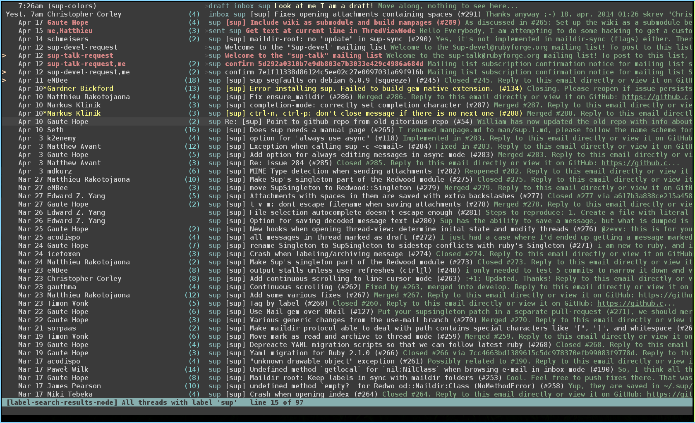
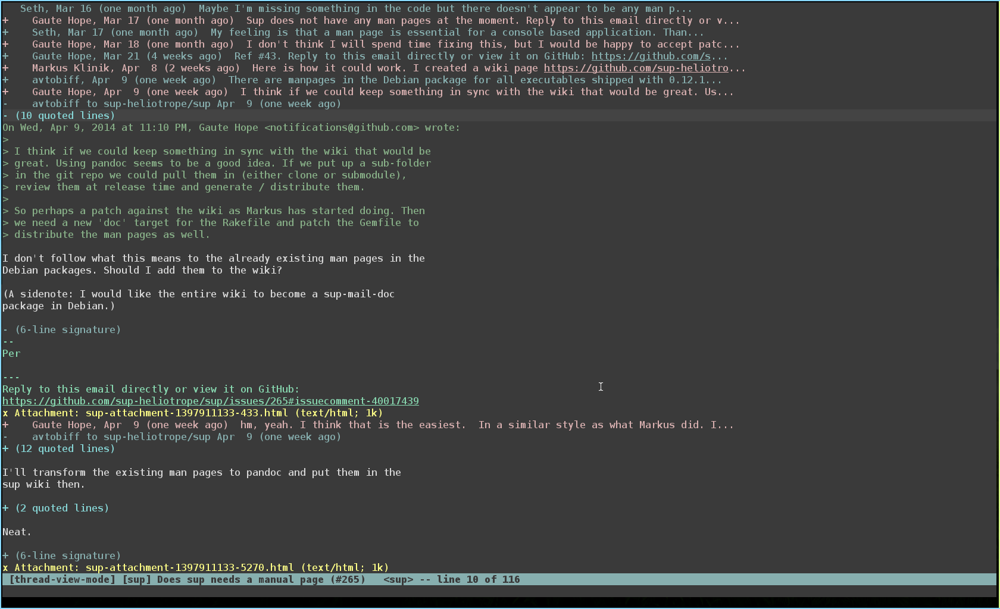

Sup Vimburn
========
A [sup](https://github.com/sup-heliotrope/sup) colorscheme. Based on the [Zenburn](https://github.com/jnurmine/Zenburn) colorscheme for vim.

## Thread Index View

## Thread View

